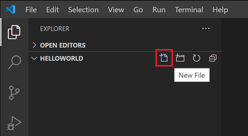
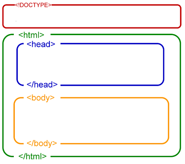
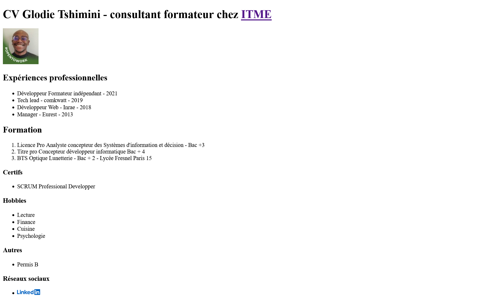

# Devoir sur votre CV

---

## Énoncé

1. Réalisez uniquement avec le langage HTML votre CV.

---

## Modalités

- Créez un nouveau fichier `cv.html`

- Un titre h1
- Plusieurs titres de niveau inférieur à h1
- Des paragraphes
- Une image
- Des liens externes vers un ou plusieurs réseaux sociaux, les sites des écoles, etc.
- Vérifier la validité de votre code HTML sur le site [validator de w3](https://validator.w3.org/#validate_by_input)
- Des listes numérotées et non numérotées

---

## Rappels du cours sur le HTML

HTML est le langage de base qui permet de structurer une page web. C'est un langage de balisage, c'est-à-dire qu'il est composé d'un ensemble des balises ou tags en anglais.
Chaque balise a un rôle et un objectif bien précis pour représenter une information spécifique comme un titre, un lien, une image, une liste, un tableau, un formulaire, etc.

### Structure de base

- `html:5` : permet de générer la structure de base d'un document html (page web)
- `<!DOCTYPE html>` : signale au navigateur que le document courant est un fichier html
- `<html></html>` : début du document html
- `<head></head>` : premier enfant de la balise `<html>`, on y trouve des métadonnées (informations supplémentaires pour aider le navigateur à bien comprendre notre document) ou des liens vers les fichiers  des autres langages Web, CSS, JavaScript qui seront abordés plus tard. Le contenu présent dans la balise `<head>` n'est généralement pas visible au niveau du navigateur.
- `<body></body>` : corps de notre document HTML et 2e enfant de la balise `html`. Hormis les commentaires, tout ce qui se trouve entre les balises `<body></body>` sera visible sur un navigateur.

[source image apcpedagogie](https://apcpedagogie.com/wp-content/uploads/2017/03/html-body.png)

### Règles générales

1. La majorité des balises fonctionnent par paire, une balise ouvrante et une balise fermante.
- Motif d'une balise ouvrante `<nom de la balise>`
- Motif d'une balise fermante `</nom de la balise>`
- Certaines balises sont auto-fermantes (ne nécessite pas la présence de la balise fermante) comme la balise `` ou `<meta>`
2. Document HTML = Page HTML = Page Web
3. Un site est composé d'un ou de plusieurs pages web.
4. Le premier fichier lu par le navigateur dans un site web est le fichier `index.html`, c'est comme le bonjour le matin ou la page d'authentification lorsque vous ouvrez votre PC ou MAC.
5. Il faut respecter l'ordre d'ouverture et de fermeture de vos balises : premier ouvert, dernier fermé
6. Certaines balises s'accompagnent d'attribut comme la balise `img`. Un attribut est une information complémentaire à la balise.
La plupart des attributs sont spécifiques à une balise. Par exemple src et alt sont propres à l'image tandis que la balise href est spécifique à la balise a. Un attribut s'accompagne forcément d'une valeur qu'on renseigne entre les guillemets.
7. Les attributs et leurs valeurs respectives doivent toujours être à l'intérieur de la balise ouvrante (avant le crochet `>`)
8. Une page web ou html = un seul thème, ce qui explique que vous pouvez avoir qu'un seul `h1` (grand titre) par page.
9. Dans le body, hormis h1, toutes les autres balises, je peux les utiliser autant de fois que je le souhaite dans mon document html.
10. L'ordre d'écriture de votre code est le même que l'ordre de l'interprétation et d'affichage par le navigateur de votre code.
11. Sans CSS (langage qui permet d'habiller votre page), les navigateurs appliquent un style ("habits et maquillage") par défaut. L'affichage peut être différent d'un navigateur à un autre parce que chaque navigateur applique son propre style pour chaque type (même) de balise.

### Dans la balise `<head></head>`

- `<title>Page d'accueil</title>` : balise permettant d'afficher le titre de la page visible depuis l'onglet du navigateur

### Les titres dans le `<body></body>`

Objectif : hiérarchiser son contenu avec 6 niveaux de titres disponibles selon l'importante du contenu. C'est comme un journal, vous avez des grands titres qu'on doit voir tout de suite et d'autres moins importants.
- `<h1>Titre Principal</h1>` : Titre de niveau 1, grand titre, un seul titre h1 par document html. C'est l'équivalent du gros titre d'un article de journal
- `<h2>Titre de niveau 2</h2>` : Titre de niveau 2, moins important que `h1`, il peut y avoir plusieurs h2 dans un document HTML
- `<h3>Titre de niveau 3</h3>` : Titre de niveau 3, moins important que `h1` et `h2`, il peut y avoir plusieurs h3 dans un document HTML
- `<h4>Titre de niveau 4</h4>` : Titre de niveau 4, moins important que `h1`, `h2` et `h3`, il peut y avoir plusieurs h4 dans un document HTML
- `<h5>Titre de niveau 5</h5>` : Titre de niveau 5, moins important que `h1`, `h2`, `h3` et `h4`, il peut y avoir plusieurs h5 dans un document HTML
- `<h6>Titre de niveau 6</h6>` : Titre de niveau 6, moins important que `h1`, `h2`, `h3`, `h4` et `h5`, il peut y avoir plusieurs h6 dans un document HTML

### Les images

Objectif : afficher des images à partir d'une source locale (le fichier est stocké sur votre PC ou MAC, idéalement au sein du dossier qui contient votre projet) ou extérieure (lien d'une image depuis une autre page d'un autre site web)
``
- Attribut `src` sert à donner le lien interne ou externe vers la source de l'image
- Attribut `alt` pour alternative, c'est-à-dire, dans le cas ou la source de l'image est mauvaise, l'image ne pourra pas être chargée par le navigateur, à la place la valeur et donc le texte indiqué au sein de l'attribut `alt` sera alors visible.

### Les paragraphes dans le `<body></body>`

Objectif: des paragraphes contenant du texte.

- `
` : p pour paragraphe

### Les listes dans le `<body></body>`

Objectif : réaliser des listes d'éléments appartenant à la même famille (similaires) 
2 types de liste, les listes ordonnées et les listes non ordonnées.
A l'intérieur des balises `ul` (liste non ordonnée) ou `ol` (liste ordonnée) entre les balises ouvrante et fermante, vous devez absolument avoir au moins une balise enfant `li`.
- `<ul><li>Item</li></ul>` 
- `<ol><li>Item</li></ol>`
- `<ol></ol>` : sans au moins un `li` votre code est faux.
- `<ul></ul>` : idem.
- `<ol></ol><li></li>` : Avec un `li` à l'extérieur d'un `ol` `ul` c'est également mauvais.
- `<ul>

<ul>` : à l'intérieur d'un `ul` ou `ol`, vous avoir uniquement comme enfant direct que des `li`, par contre entre une balise ouvrante et fermante `li`, vous pouvez avoir des images, des liens. D'un point de vue sémantique, ça n'a pas de sens de mettre un paragraphe `p` à l'intérieur d'un `li`

### Lien hypertexte dans le `<body></body>` avec la balise a

Objectif: créer des liens vers d'autres pages de notre projets ou des pages externes tels que *facebook*, *linkedin*, *amazon* etc.
Vous pouvez créer des liens hypertextes sur un texte ou une image.
La balise a s'accompagne des attributs :
- `href` : lien vers une page interne ou une page externe au site web
- `target` : permet de préciser au navigateur le comportement au moment du clique. Il y a plusieurs valeurs mais on retiendra `_blank` qui permet d'ouvrir le site sur une nouvelle page. On l'utilise souvent lorsqu'on a recours à un lien externe et qu'on souhaite que l'utilisateur puisse rester dans notre page. Par contre, c'est souvent inutile de l'utiliser lorsqu'on navigue vers une autre page de notre site.

Exemples

- `<a href="https://www.linkedin.com/">Lien textuelle vers le site linkedin</a>` : le lien s'ouvrira dans la page courante (à la place de votre site)
- `<a href="https://www.google.com/" target="_blank">Lien textuelle vers le site google en ouvrant un nouvel onglet</a>` : le lien s'ouvrira dans un nouvel onglet donc l'utilisateur reste sur votre site
- `` : lien cliquable depuis la photo qui sera affiché, au clique sur celle-ci le navigateur ouvrira un nouvel onglet vers *linkedin*

---

## Exemple du travail attendu

